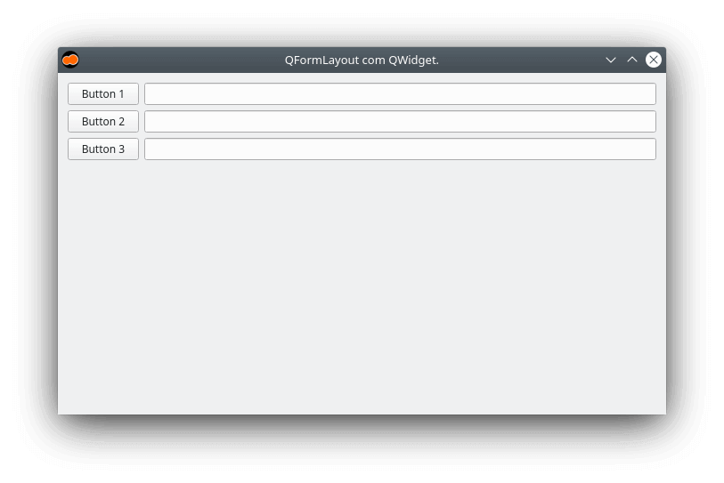
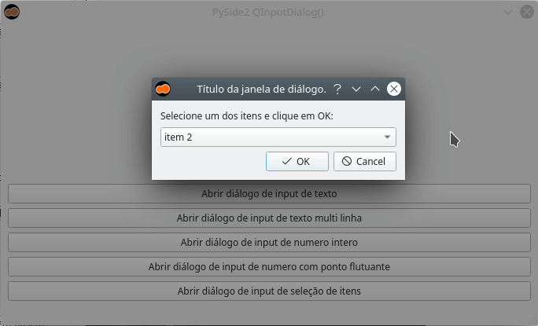

# PySide2

O [PySide2](https://pypi.org/project/PySide2/) é o binding oficial do Qt para a linguagem de programação [Python](https://www.python.org/).

Este repositório possui diversos exemplos de código utilizando o mesmo.

## Instalação

```bash
pip install PySide2
```

> É **recomenda** a instalação do PySide2 em um ambiente virtual (pyenv, pipenv, virtualenv, etc).

## Qt

O Qt é um framework multiplataforma para desenvolvimento de interfaces gráficas criado pela empresa norueguesa Trolltech em 1991. Os desenvolvedores originais nessa época era Haavard Nord (CEO) e Eirik Chambe-Eng (Presidente).

Ele é utilizado largamente no ambiente [desktop KDE](https://kde.org/) e o atual mantenedor é a [The Qt Company](https://www.qt.io/).

Até o momento em que escreve o Qt possui bindings **oficiais** para as linguagens:

- [C++](https://doc.qt.io/qt-5/qtwidgets-index.html#getting-started).
- [Python (PySide2)](https://www.qt.io/qt-for-python).

Dentre os principais bindings de terceiros exite o suporte as seguintes linguagens:

- [C#/Mono/.Net (QtSharp)](https://gitlab.com/ddobrev/QtSharp).
- [C#/Mono/.Net (Qml.Net)](https://gitlab.com/ddobrev/QtSharp).
- [Crystal (qt5.cr)](https://github.com/Papierkorb/qt5.cr).
- [D (QtE5)](https://github.com/MGWL/QtE5).
- [Go (qt)](https://github.com/therecipe/qt).
- [Haskell (qtHaskell)](http://www.isptech.co.uk/qtHaskell/index.html).
- [Haskell (Qtah)](https://gitlab.com/khumba/qtah).
- [Java (javacpp-presets)](https://github.com/bytedeco/javacpp-presets/tree/master/qt).
- [Java (QtJambi5)](https://github.com/OmixVisualization/qtjambi5/).
- [Julia (QML.jl)](https://github.com/barche/QML.jl).
- [Node.js (NodeGui)](https://github.com/nodegui/nodegui).
- [Python (PyQt)](https://riverbankcomputing.com/software/pyqt/intro).
- [Ring (RingQt)](https://ring-lang.sourceforge.io/doc/qt.html).
- [Rust (Rust-Qt)](https://github.com/rust-qt).

## Tutoriais

- [Como instalar o Qt Creator](https://codigoninja.dev/posts/instalar-qt-creator/).
- [Como instalar o Qt Designer](https://codigoninja.dev/posts/instalar-qt-designer/).
- [Como instalar a linguagem de programação Python no Linux e Windows ](https://codigoninja.dev/posts/instalar-linguagem-programacao-python-linux-windows/)

## Código

### Janela principal.

- [Lendo arquivo XML](./src/mainwindow/xml).
- [Criando uma janela com Python](./src/mainwindow/).


### Gerenciadores de layout

- [QFormLayout (XML)](./src/layouts/form/xml).
- [QFormLayout Python](./src/layouts/form).



- [QGridLayout (XML)](./src/layouts/grid/xml).
- [QGridLayout Python](./src/layouts/grid).


- [QHBoxLayout (XML)](./src/layouts/hbox/xml).
- [QHBoxLayout Python](./src/layouts/hbox).


- [QVBoxLayout (XML)](./src/layouts/vbox/xml).
- [QVBoxLayout Python](./src/layouts/vbox).


### Menus

- [QMenuBar (XML)](./src/menus/menubar/xml).
- [QMenuBar Python](./src/menus/menubar).


- [QStatusBar (XML)](./src/menus/statusbar/xml).
- [QStatusBar Python](./src/menus/statusbar).


- [QToolBar (XML)](./src/menus/statusbar/xml).
- [QToolBar Python](./src/menus/statusbar).


### Diálogos

- [QColorDialog (XML)](./src/dialogs/color/xml).
- [QColorDialog Python](./src/dialogs/color/xml).


- [QFileDialog (XML)](./src/dialogs/file/xml).
- [QFileDialog Python](./src/dialogs/file).


- [QFontDialog (XML)](./src/dialogs/font/xml).
- [QFontDialog Python](./src/dialogs/font).


- [QInputDialog (XML)](./src/dialogs/input/xml).
- [QInputDialog Python](./src/dialogs/input).



- [QMessageBox (XML)](./src/dialogs/messagebox/xml).
- [QMessageBox Python](./src/dialogs/messagebox).


- [QProgressDialog (XML)](./src/dialogs/progress/xml).
- [QProgressDialog Python](./src/dialogs/progress/xml).


### Banco de dados

Exemplos de CRUD (Create, Read, Update, Delete) com `QSqlDatabase`:

- [PySide2 com SQLite3](./src/database/db-sqlite).
- [PySide2 com PostgreSQL](./src/database/db-postgres).


### Signal, Slots e Connect

- [Connect (XML)](./src/signals-slots/xml).
- [Connect Python](./src/signals-slots).

### Gerando executáveis

- [Cx_Freeze](./src/gen-exec/_cx_freeze).
- [PyInstaller](./src/gen-exec/_pyinstaller).

## QML

### Janela principal.

- [Lendo arquivo QML engine](./src/qml/mainwindow/engine).
- [Lendo arquivo QML qquickview](./src/qml/mainwindow/qquickview).

### Signal, Slots e Connect

- [Connect com engine](./src/qml/signals-slots/connect-engine).
- [Connect com quickview](./src/qml/signals-slots/connect-quickview).
- [Slot com engine](./src/qml/signals-slots/slot-engine).

### Gerando executáveis

- [Cx_Freeze](./src/qml/gen-exec/_cx_freeze).
- [PyInstaller](./src/qml/gen-exec/_pyinstaller).

## Kirigami2

ToDo

### Instalação

**Fedora**:

```bash
sudo dnf install kf5-kirigami2 kf5-kirigami2-devel
```

**Ubuntu**:

```bash
sudo apt install kirigami2 kirigami2-dev
```
